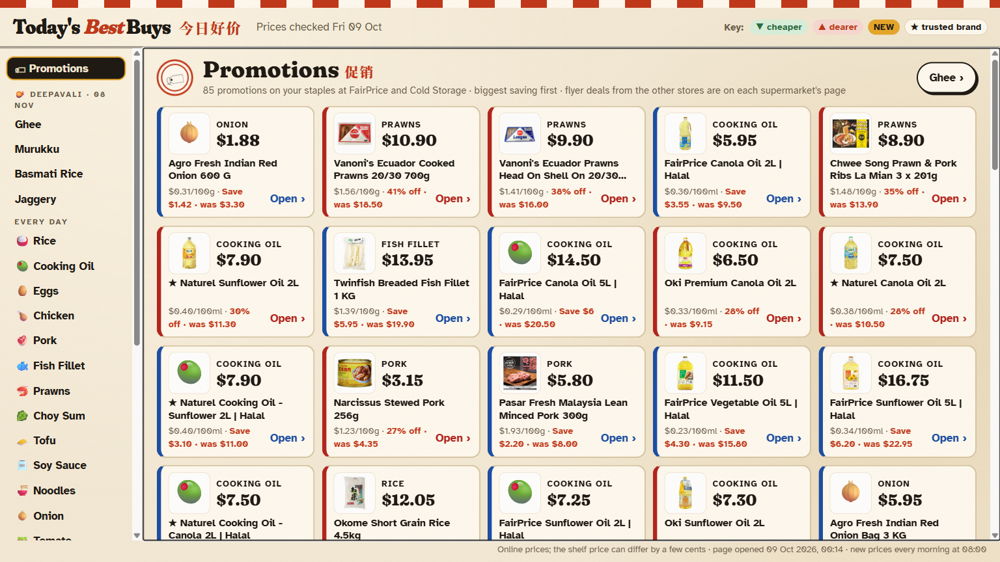
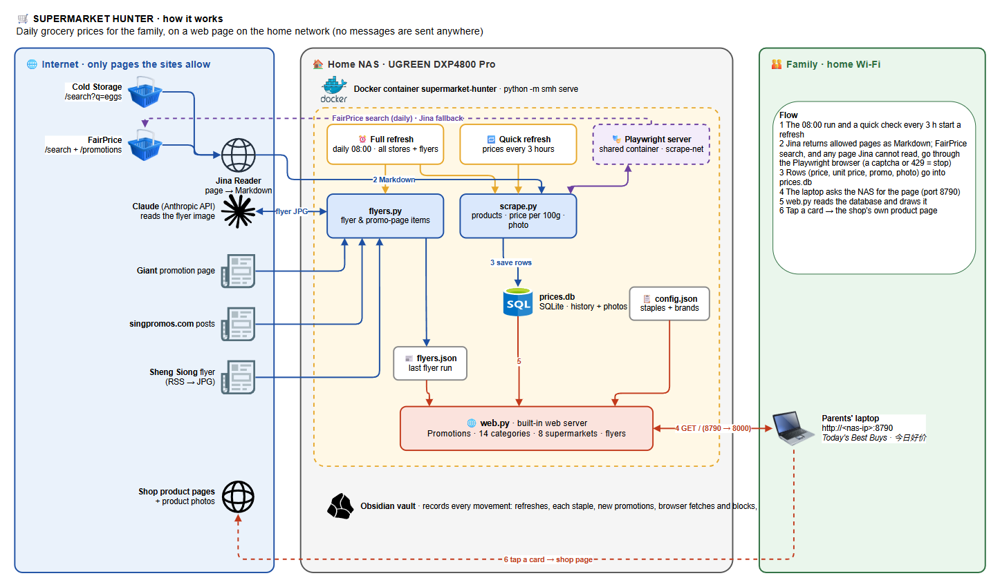

# Supermarket Hunter

Family grocery price web page for Singapore. Every morning (08:00) it finds the **best value** pack of each staple the
family cooks with: price per 100g / 100ml / piece, so a 10kg bag and a 5kg bag compare fairly, with trusted brands first.
It shows everything on a **web page on the home network**, with product photos, the supermarkets' own logos and one tap
through to the shop's product page. Nothing is sent anywhere: the page is the only output, and an Obsidian vault on the
NAS records every movement.



## How it works



Editable source: [`docs/architecture.drawio`](docs/architecture.drawio) (open in [draw.io](https://app.diagrams.net); regenerate with
`python tools/gen_arch.py docs/architecture.drawio`).

One Docker container on a home NAS runs `python -m smh serve`:

| Thread | When | Does |
|---|---|---|
| Daily update | 08:00 SGT | every item at every store we can read, plus the flyer sources. Must happen: it catches up at start-up if 08:00 was missed (NAS or container down), retries a failed run 3× 30 min apart, and the page header shows "✓ Updated today HH:MM" (red if not) |
| Quick refresh | every 3 h | Cold Storage prices again, so new promotions reach the page within hours |
| **Web server** | always | the family web page on port 8790 |

**The data path**
1. A refresh searches each staple. Cold Storage is read through [Jina Reader](https://r.jina.ai), which returns the page
   as Markdown: one link per product with name, price, old price, promo and photo.
2. FairPrice search, and any page Jina cannot read, goes through a shared **Playwright** browser on the NAS
   (`ws://playwright:3000` on the Docker network `scrape-net`). Its product links are turned into the same Markdown, so one
   parser per store serves both routes. A captcha / challenge page or a 429 stops the fetch; it is never worked around.
3. Every row is saved to `data/prices.db` (SQLite) with its unit price and photo URL. The history gives
   "cheaper ▼ / dearer ▲ since last time", "lowest in 8 weeks, stock up" and 🆕 for promotions first seen today.
4. Flyer sources (FairPrice promotions, Sheng Siong's flyer read by Claude, Giant's promotion page, singpromos.com) go to
   `data/flyers.json`.

**The web page** (`smh/web.py`, Python's built-in `http.server`): a browser on the home Wi-Fi opens
`http://<nas-ip>:8790`; the page is drawn from the database **on every visit**, so it is always as fresh as the data, and
the header shows the date the prices were checked (in red if the morning run failed). One screen at a time, no scrolling
on a laptop:

- **🏷 Promotions** (first): every current promotion on the staples, new ones first, then the biggest saving.
- **One screen per staple**: the best-value pack as a big price tag (★ = a brand the family trusts) and the next nine in a
  3×3 grid, cheapest per 100g first. Big ‹ previous / next › buttons (or the arrow keys) step through.
- **By supermarket**: all eight Singapore supermarkets with their official logos (downloaded once from each store's own
  website into `data/logos/`). FairPrice and Cold Storage show their best value per staple (🏆 = cheapest of all the
  stores); the others show their flyer deals, a link to their shop and the plain reason there are no shelf prices.
- **Festive seasons** (`smh/festive.py`): about six weeks before Deepavali, Christmas, Chinese New Year, Hari Raya
  Puasa / Haji and Mid-Autumn, that festival's shopping items (bak kwa, mandarin oranges, log cake, ghee…) appear as their
  own group, searched and shown like the staples; they disappear after the day.
- **📰 Flyers**.

Every card links to the product on the shop's own website. Large type (Atkinson Hyperlegible), Chinese names for each staple.

**The vault**: `/volume1/<USER>/Obsidian/Supermarket Hunter/` (mounted at `/vault`) records every movement:
`Activity/YYYY/MM/` (refreshes, each staple's result, new promotions, browser fetches and blocks, flyers, logos, page
visits, errors), `Items/` (one note per staple), `Stores/` (one note per supermarket), `Reports/` (the 08:00 run as a table).

## Sources and rules
- **Cold Storage** search through Jina (robots.txt allows it). **FairPrice** search through the NAS browser, once a day,
  one page at a time (its robots.txt disallows `/search` for crawlers; the owner's rule allows the NAS browser for such
  pages at personal, low volume). Its `/promotions` page is read through Jina.
- **RedMart** (on Lazada) search through the NAS browser, once a day: its search cards keep the price beside the product
  link, so the browser reads the whole card.
- **Prime** has no online shop: its weekly flyer picture (Advertised Offers page) is read by Claude, once a day.
- **Sheng Siong**'s shop is behind an anti-bot check, and since 2026-10-09 its flyer feed answers the NAS with the same check:
  nothing is read, never bypassed. **Giant** has no online shop any more (foodpanda app only): its promotion page only.
- **Hao Mart**'s online shop lists no products, even in a real browser. **Amazon Fresh** groceries only show to signed-in
  Prime members, so they are not read.
- No stealth plugins, proxies, rotating IPs or captcha solvers. A few seconds between pages.

## Run
```bash
cp .env.example .env          # optional JINA_API_KEY, CLAUDE_CODE_OAUTH_TOKEN (Sheng Siong flyer)
docker network create scrape-net   # once; the shared Playwright server joins it too
docker compose up -d --build
# web page: http://<nas-ip>:8790   (WEB_PORT inside the container, default 8000; 0 turns it off)
docker compose exec supermarket-hunter python -m smh refresh     # full refresh now
docker compose exec supermarket-hunter python -m smh ask eggs    # quick look from the shell
python -m pytest tests -q                                        # local checks
```
Staples and trusted brands live in `data/config.json` (created on first run from `smh/store.py` DEFAULT; edit it by hand).
